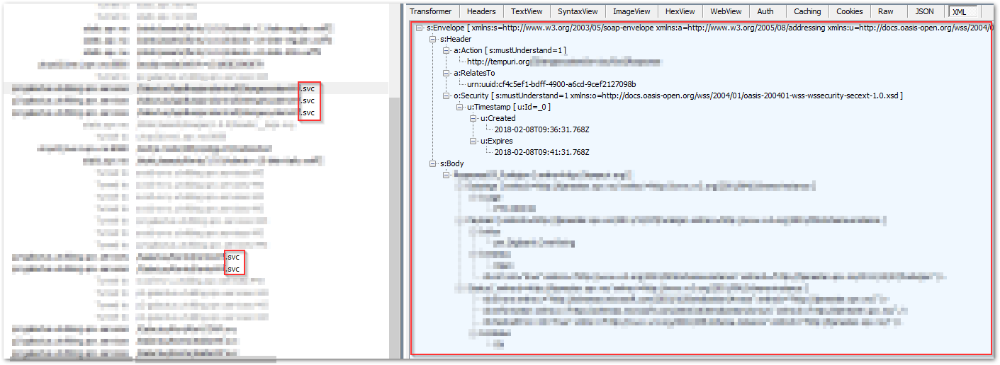

## :confused: What?

Diddle enables an IIS-wide proxy which is set to target Fiddler's defaults (`127.0.0.1:8888`).

When Diddle is enabled, all taffic made by websites in your local IIS is routed through Fiddler, including _server-to-server_ and _SOAP_ calls. This is helpful for debugging and tracing during development.


_Fiddler capturing WCF SOAP request/responses from server-to-server calls_
 
## :dizzy_face: How?

When you **enable** Diddle, it creates the file `C:\inetpub\wwwroot\Web.config` with this content:

```xml
<?xml version=""1.0"" encoding=""UTF-8""?>

<configuration>
   
    <!-- The following section is to force use of Fiddler for all applications, including those running in service accounts -->
    <system.net>
      <defaultProxy enabled=""true"" useDefaultCredentials=""true"">
        <proxy bypassonlocal=""False"" proxyaddress=""http://127.0.0.1:8888"" usesystemdefault=""False""/>
      </defaultProxy>
    </system.net>

</configuration>
```
(Thanks to [Eric Lawrence](https://www.telerik.com/blogs/author/eric-lawrence) for writing [this article](https://www.telerik.com/blogs/capturing-traffic-from-.net-services-with-fiddler) explaining the trick and the code).

When you **disable** Diddle, it **deletes** the file.

:exclamation: If you have this Web.config file already configured on your machine with configuration you need, you should **NOT** use this app for now. It will delete and re-create the Web.config file every time you enable and disable Diddle.

## :sweat_smile: Remember

- :exclamation: You must run the app (or terminal, if using the ConsoleClient) as **Administrator**. Or allow your user or the _Everyone_ group to read+write the Web.config file. 
- :vertical_traffic_light: As long as the Web.config file has proxy enabled, you must have Fiddler opened for any traffic to pass through the proxy
- :persevere: If you encounter issues with HTTPS decryption, you can skip decryption in Fiddler under `Tools -> Options -> HTTPS` and then click the link above the last textbox so it says "Skip decryption for the following hosts" and enter the hosts it should skip